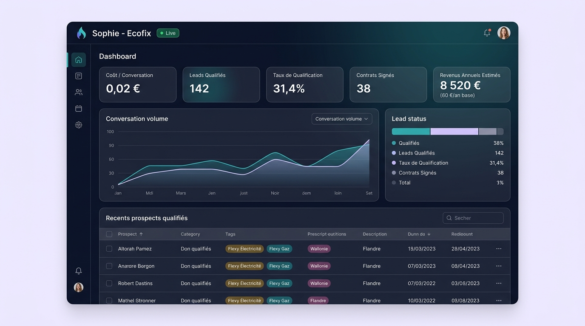
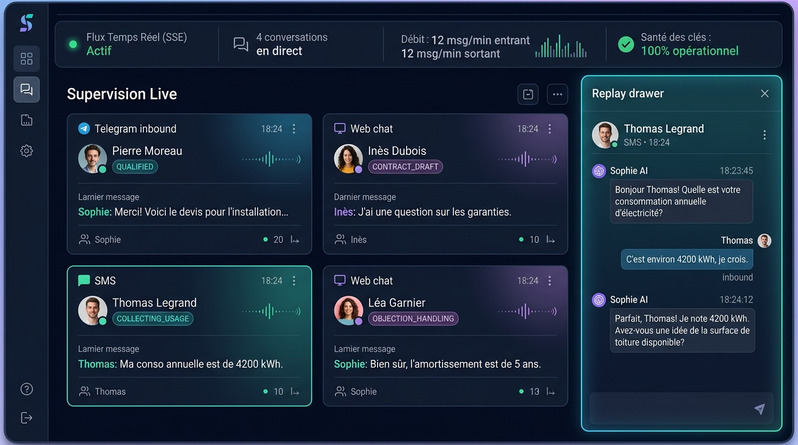

# Sophie — Agent IA de vente Ecofix

[](https://github.com/Yosra-Megbli/Intelligent-Sales-Agent/actions/workflows/ci.yml)


Sophie est un agent conversationnel IA qui qualifie des prospects pour des contrats d'électricité et de gaz Ecofix : elle engage la conversation, répond aux objections, collecte et valide les informations nécessaires, génère le contrat et le fait signer électroniquement, puis transmet les leads qualifiés à l'équipe commerciale humaine.

## In short (EN)

A production-shaped AI sales agent, not a chatbot demo: a deterministic state machine + declarative YAML rules engine owns every dialogue/qualification decision — the LLM (Groq/Llama) only phrases replies in natural language, it never decides a state transition. Multi-channel (Telegram + Web live, SMS ready; WhatsApp and outbound Voice fully wired end-to-end via Twilio, pending activation), with an outbound campaign engine, PDF contract generation, Yousign e-signature integration, a React ops dashboard, a RAG v2 knowledge base with citation validation, API-key/webhook-signature security, and **over 1,000 automated tests** including end-to-end golden conversation scenarios. See below (French) for full docs — this project is built for a real French-speaking client.

## Statut du projet & déploiement en production

Le projet est **déployé en production** sur une infrastructure cloud moderne, sécurisée et optimisée (100 % free tier pour le pilote).

### Infrastructure de production live

| Composant | Fournisseur / Technologie | Statut / URL |
|---|---|---|
| **Backend API** | Render (Docker `python:3.12-slim`, auto-migrations) | `https://intelligent-sales-agent.onrender.com` |
| **Healthcheck** | Endpoint public DB + Redis | [`/health`](https://intelligent-sales-agent.onrender.com/health) (`{"status":"ok"}`) |
| **Base de données** | Neon (PostgreSQL managé + extension pgvector) | Actif, index HNSW cosinus 768d |
| **Cache & Pub/Sub** | Upstash (Redis serverless) | Actif pour le rate limiting et le streaming SSE |
| **Frontend** | Vercel (React 18 + Vite + TypeScript) | Déployé avec proxy API sécurisé |
| **Inférence IA** | Groq Cloud (`openai/gpt-oss-120b` / Llama 3.3) | ~300 ms de latence moyenne |
| **Bot Telegram** | Pilote inbound multi-canal | [`@EcofixSalesBot`](https://t.me/EcofixSalesBot) (actif en direct) |

### Cycle de vie et signature contractuelle

Sophie qualifie les prospects de bout en bout et pilote le cycle contractuel complet :

```
NOUVEAU LEAD → QUALIFIÉ → CONTRAT GÉNÉRÉ (PDF) → ENVOI YOUSIGN → SIGNÉ / CLIENT ACTIF
```

- **Génération de contrat PDF** : module ReportLab (`contracts/pdf_generator.py`) incluant les mentions légales obligatoires (loi IA européenne, droit de rétractation de 14 jours, grille tarifaire officielle).
- **Signature électronique** : intégration Yousign Sandbox v3 (`integrations/yousign.py`) avec webhooks HMAC sécurisés et simulation de signature instantanée (`POST /api/contracts/{id}/simulate-sign`). Dégradation propre si `YOUSIGN_API_KEY` n'est pas configurée : le flux s'arrête proprement à l'étape PDF sans planter.

## Économie réelle en production (unit economics)

Les métriques financières affichées dans le tableau de bord reflètent la réalité du marché belge et la stricte vérité tarifaire Ecofix :

### 1. Structure de coûts de fonctionnement
- **Coût d'inférence par conversation qualifiée** : ~0,02 € (architecture hybride : moteur déterministe YAML + extraction Groq ultra-rapide).
- **Coût d'infrastructure d'hébergement** : 0,00 € / mois en phase pilote grâce aux niveaux gratuits de Render, Neon, Upstash et Vercel.
- **Marge brute d'acquisition** : > 99 % d'économie par rapport aux coûts d'un centre d'appels classique (8 à 15 € par lead qualifié par un opérateur humain).

### 2. Vérité tarifaire Ecofix (septembre 2026)
- **Frais fixes de base (obligatoires)** : 60,00 € / an par contrat d'énergie (électricité ou gaz).
- **Option Ecofix Digi (strictement optionnelle)** : 5,99 € / mois pour le suivi temps réel et le pilotage intelligent via l'application mobile — jamais présentée comme une redevance de base.
- **Programme de parrainage « Friends with Benefits »** : remise permanente de 5,00 € / mois par filleul actif, sans plafond de cumul.
- **Frais de sortie résidentielle en Belgique** : 0,00 € (résiliation libre à tout moment, bascule standard sous 3 à 4 semaines).

### 3. Ratio financier du pilote
Pour 1 000 conversations menées par Sophie :
- Coût total d'inférence IA : 20,00 €
- Leads hautement qualifiés (~30 %) : 300 prospects
- Contrats conclus estimés (~10 %) : 100 souscriptions
- Chiffre d'affaires brut généré (frais fixes seuls) : 6 000 € / an (hors consommation volumétrique et abonnements Digi)

## Captures d'écran de la production

### Tableau de bord & économie réelle


### Supervision live (cockpit SSE) & tiroir replay


## Architecture

```
backend/                      API Python/FastAPI
├── domain/                   Modèles métier (Lead, Conversation, Message, Campaign, Activity) + enums
├── conversation_engine/      State machine pure + Rules Engine (YAML) + Intent Classifier + Dialogue Policy
├── business_rules/           Règles déclaratives en YAML (qualification, validation, follow-up...)
├── ai/                       Abstraction LLM (Groq), extraction, génération de réponse, RAG
├── rag_v2/                   Base de connaissances RAG v2 (ingestion, cycle de vie, recherche vectorielle)
├── prompts/                  Prompts en Markdown/YAML (jamais codés en dur en Python)
├── crm/                      Repositories (leads, conversations, activités, campagnes)
├── channels/                 Adaptateurs par canal (Web, Telegram, SMS ; WhatsApp/Voice prêts, non activés)
├── outbound/                 Moteur de campagnes sortantes
├── followup/                 Détection de silence + relances automatiques
├── contracts/                Génération de contrat PDF (specimen certifié, mentions légales)
├── integrations/             Yousign (signature électronique)
├── live/                     Cockpit de supervision temps réel (SSE)
├── api/                      Routes FastAPI, sécurité (clé API, rate limiting, CORS)
├── application/              Services applicatifs (orchestrent domain + conversation_engine + crm)
├── dashboard/                Build compilé du dashboard React, servi en statique par FastAPI
├── docs/                     Documentation d'architecture (state machine, décisions techniques)
└── tests/ + golden_tests/    Suite de tests unitaires/intégration + scénarios de conversation bout en bout

frontend/
├── artifacts/sophie-dashboard/   Dashboard React (Vite + Tailwind + shadcn/ui + TanStack Query)
├── artifacts/api-server/         Proxy Node/Express (prod) : masque la clé API au navigateur
└── lib/                          Client API généré depuis lib/api-spec/openapi.yaml
```

**Principe central** : le moteur métier (state machine + règles YAML) décide seul de l'état de la conversation et du statut du lead. Le LLM ne fait que formuler les réponses en langage naturel — il ne décide jamais d'une transition d'état ni d'une qualification.

## Stack technique

- **Backend** : Python 3.12+, FastAPI, SQLAlchemy, PostgreSQL (SQLite pour les tests), Redis
- **IA** : Groq (`openai/gpt-oss-120b` par défaut), abstraction `LLMProvider` remplaçable
- **Frontend** : React, Vite, TypeScript, Tailwind v4, shadcn/ui, TanStack Query
- **Tests** : Pytest — plus de 1 000 tests unitaires/intégration + scénarios golden

## Démarrage rapide — backend

```bash
cd backend
python -m venv .venv
source .venv/bin/activate      # Windows : .venv\Scripts\activate
pip install -r requirements-dev.txt
cp .env.example .env           # puis renseigner GROQ_API_KEY, DATABASE_URL, etc.
uvicorn api.main:app --host 127.0.0.1 --port 8001
```

Le port `8001` n'est pas arbitraire : c'est celui que le dashboard React attend (`frontend/artifacts/sophie-dashboard/vite.config.ts` y proxifie `/api` en dev).

- Documentation API interactive : http://127.0.0.1:8001/docs
- Healthcheck : http://127.0.0.1:8001/health

## Démarrage rapide — dashboard React

```bash
cd frontend
pnpm install
pnpm --filter sophie-dashboard dev   # http://localhost:5173, proxy /api -> localhost:8001
```

En production, le dashboard passe par `frontend/artifacts/api-server` (proxy Node/Express) qui injecte la clé API côté serveur, pour ne jamais l'exposer au navigateur.

## Migrations DB

Ce projet n'utilise pas Alembic en routine : `database/postgres.py` appelle `Base.metadata.create_all()` au démarrage, qui crée les tables manquantes mais ne modifie jamais une table existante. Un changement de schéma sur une table déjà créée (nouvelle colonne, nouvel index...) nécessite donc un `ALTER TABLE` manuel, en plus du changement dans `domain/models/`.

Les scripts SQL correspondants vivent dans `backend/database/migrations/`, numérotés dans l'ordre où ils doivent être appliqués :

```bash
psql "$DATABASE_URL" -f backend/database/migrations/0001_add_telegram_chat_id.sql
```

Sur une base de dev jetable (recréée à chaque fois), ce n'est pas nécessaire : `docker compose down -v && docker compose up -d` puis un redémarrage du backend suffit, `create_all()` crée alors le schéma à jour directement.

## Tests

```bash
cd backend
pip install -r requirements-dev.txt
pytest tests/ golden_tests/ -v
```

> Redis doit être démarré localement (`redis-server`) pour que la suite complète passe : plusieurs tests (opt-out, disclosure guard, live cockpit, RAG v2) passent par le cache Redis réel plutôt qu'un mock.

## Écrans du dashboard React

Le dashboard d'administration et de supervision comporte 8 écrans complets :

- **Tableau de bord** (`/`) : indicateurs clés (taux de qualification, coût moyen par conversation ~0,02 €, coût d'acquisition, revenus annuels estimés avec distinction frais fixes 60 €/an et add-on Digi optionnel 5,99 €/mois).
- **Prospects & Leads** (`/leads`) : tableau CRM en temps réel, filtres multi-critères, tiroir de détail du lead (données CRM, timeline d'activités, génération et suivi du contrat PDF).
- **Conversations & Replay** (`/conversations`) : historique trilingue des dialogues par canal, drawer de relecture pas à pas avec trace d'audit.
- **Supervision Live** (`/live`) : cockpit temps réel alimenté par flux SSE (Server-Sent Events) via jeton HMAC signé, cartes de conversation actives dynamiques, compteurs in/out par minute, tiroir replay intégré et repli automatique sur polling 30 s si la liaison est interrompue plus de 60 s.
- **Campagnes sortantes** (`/campaigns`) : gestion des campagnes sortantes SMS, prévisualisation obligatoire avant lancement (aperçu de divulgation IA légale et comptage réel des cibles), pause/reprise et métriques de progression en direct.
- **Base de connaissances** (`/knowledge`) : gestionnaire RAG v2 avec table des documents sources PDF, statut de cycle de vie (Brouillon / Publié / Archivé), zone de téléversement avec vérification de la couche texte, testeur QA de transparence (inspection des segments extraits et score sans appel LLM), alertes d'obsolescence (cycle W3) et table de repli RAG v1 par mots-clés.
- **Simulateur** (`/simulator`) : bac à sable interactif multi-canal et multi-langue (FR, NL, EN) permettant d'éprouver les 5 couches anti-hallucination et les règles d'admissibilité en direct.
- **Paramètres** (`/settings`) : gestion sécurisée des clés API, secrets de webhooks, simulation Yousign Sandbox pour validation du cycle de vie contractuel et statut de santé des intégrations.

## Architecture RAG v2

Le système RAG v2 implémente les patrons ZEN Knowledge adaptés à FastAPI et pgvector :

### 1. Ingestion explicite et cycle de vie (publish-explicit)
- Découpage par fenêtres de ~500 tokens (50 tokens de recouvrement) sans perte d'information.
- Tout document ingéré est créé au statut `DRAFT` : ses segments vectoriels restent strictement invisibles pour Sophie jusqu'à sa publication manuelle et explicite.
- Cycle de vie complet `DRAFT → PUBLISHED → ARCHIVED`.

### 2. Double moteur de recherche et seuil de pertinence (relevance gate)
- Recherche vectorielle : `PgVectorSearch` (distance cosinus `<=>` PostgreSQL) en production, `InMemoryCosineSearch` (cosinus Python pur) sur SQLite et en tests.
- Seuil de similarité `RAG_MIN_SIMILARITY` (défaut `0.30`) et extraction bornée `RAG_TOP_K` (défaut `20`).
- Chaîne de repli à double niveau :
  1. Si aucun segment n'atteint le seuil minimal, repli transparent vers le RAG v1 par mots-clés.
  2. Si aucune entrée mot-clé ne correspond, refus déterministe trilingue sans aucun appel LLM (FR/NL/EN).

### 3. Génération ancrée et validateur de citations
- Les segments valides sont injectés sous forme de blocs `[SOURCE n]` avec titre, version et date de revue.
- Le validateur de citations (`rag_v2/citations.py`) retire et trace (`CITATION_STRIPPED`) toute référence `[SOURCE n]` non présente dans le contexte fourni.
- Une couche de garde regex (layer 5) valide la réponse finale contre toute statistique inventée ou promesse absolue.

### 4. Gestion de l'obsolescence (patron ZEN W3)
- Contrôle continu des dates de revue documentaire (`review_date`).
- Documents à échéance sous 7 jours signalés à l'administrateur (`due_soon`).
- Documents dépassant la période de grâce (`RAG_GRACE_PERIOD_DAYS`, défaut 30 jours) automatiquement archivés (`auto_archive_expired`).
- Détection proactive des conflits de versions sur un même type de produit.

### 5. Calibration, fournisseurs d'embeddings et coûts
- **Calibration** : ajuster `RAG_MIN_SIMILARITY` en observant les scores réels retournés par le testeur QA (`POST /api/knowledge/test`).
- **Fournisseur d'embeddings** : abstraction `EmbeddingProvider` (`ai/providers/embeddings/`) ; implémentation actuelle Google AI `text-embedding-004` (768 dimensions, niveau gratuit), interchangeable sans modifier l'application.
- **Estimation des coûts** : `/api/knowledge/stats` (nombre de segments actifs × 500 tokens × coût unitaire du fournisseur).
- **Guide d'ingestion** : `docs/RAG_V2_INGESTION_GUIDE.md` (commandes CLI pour les 12 grilles tarifaires de référence).

## Canaux

| Canal | Statut |
|---|---|
| Telegram | Actif et testé — canal du pilote |
| Web (widget) | Actif et testé |
| SMS | Architecturé et testé (`channels/sms.py`, signature Twilio), prêt pour déploiement |
| WhatsApp Business | Architecturé et testé (`channels/whatsapp.py`, signature Twilio), non activé pour le pilote actuel |
| Appel vocal | Pipeline complet câblé (`application/voice_inbound_service.py` + `channels/voice/session_manager.py`, STT/TTS Twilio) ; il ne manque qu'un compte Twilio Voice réel (`TWILIO_ACCOUNT_SID`/`TWILIO_AUTH_TOKEN`/`TWILIO_VOICE_NUMBER`/`PUBLIC_BASE_URL`) pour un appel en conditions réelles — voir `docs/architecture/voice_agent_architecture.md` |
| Messenger, Instagram, Meta Ads | Non implémentés — roadmap |

## Sécurité

- Toutes les routes API sensibles (conversations, dashboard, campagnes) protégées par une clé `X-API-Key` (comparaison à temps constant).
- Webhooks Telegram, WhatsApp/SMS (Twilio) et Yousign vérifiés par signature/secret partagé (HMAC).
- CORS désactivé par défaut (safe-by-default), à configurer explicitement via `CORS_ALLOWED_ORIGINS`.
- Rate limiting appliqué par conversation/IP.
- ⚠️ Par défaut (développement), si `API_KEY` n'est pas configurée, l'authentification est désactivée avec un avertissement en log.
- ✅ En définissant `ENVIRONMENT=production` (voir `backend/.env.example`), l'API **refuse de démarrer** si `API_KEY` ou `TELEGRAM_WEBHOOK_SECRET` ne sont pas configurées, au lieu de tourner sans authentification (`api/main.py:_fail_fast_if_misconfigured_for_production`).
- `backend/.env` (secrets réels) est exclu de git via `.gitignore` et n'a jamais été commit — pour livrer une archive au client, utiliser `scripts/package_client_delivery.ps1` (basé sur `git archive`, ne peut physiquement pas inclure un fichier non commit comme `.env`) plutôt qu'une compression manuelle du dossier.

## Conformité RGPD

Sophie intègre les principes du RGPD dès la conception (*privacy by design*) :

### 1. Bases légales de traitement (Art. 6 RGPD)
- **Leads entrants (inbound)** : consentement explicite et exécution de mesures précontractuelles à la demande du prospect (Art. 6(1)(a) et (b)) lors de l'initiation d'un échange pour étudier ou souscrire une offre d'énergie Ecofix.
- **Campagnes sortantes (outbound)** : intérêt légitime (Art. 6(1)(f)) pour la prospection commerciale sur prospects qualifiés, assorti d'une transparence obligatoire et immédiate (mention explicite de l'agent virtuel IA dès le premier message sur tous les canaux) et du droit inconditionnel d'opposition (Art. 21).

### 2. Durée de conservation (règle des 12 mois)
- Les données personnelles des prospects non convertis sont conservées 12 mois maximum à compter du dernier contact ou de la clôture de la qualification.
- À l'issue de cette période, les données d'identification (`first_name`, `last_name`, `email`, `phone`, `notes`, `date_of_birth`) sont purgées ou anonymisées de manière irréversible, sauf conversion effective en contrat client actif (soumise aux délais légaux de conservation contractuelle et comptable).

### 3. Procédure d'opt-out / droit d'opposition (STOP / STOPT / ARRÊT)
Le prospect peut à tout moment exercer son droit d'opposition en envoyant un mot-clé standardisé (`STOP`, `STOPT` ou `ARRÊT`, insensible à la casse et aux accents, en français/néerlandais/anglais). Le traitement est immédiat et déterministe, géré par le Rules Engine / `ConversationService`, sans dépendance LLM :
1. Retrait immédiat de toute campagne sortante active ou future (`campaign_id = NULL`).
2. Annulation des relances programmées ; `FollowUpEngine` ignore systématiquement tout prospect en opposition (`opt_out_at IS NOT NULL`).
3. Purge des données PII directes (`first_name`, `last_name`, `email`, `notes`, `date_of_birth`).
4. Conservation d'une clé de suppression hashée pour empêcher toute réimportation ultérieure non sollicitée.
5. Horodatage UTC (`opt_out_at`), statut mis à `REJECTED`, événement `OPT_OUT` inscrit dans le journal d'audit (`activities`).
6. Envoi d'un message unique de confirmation de désabonnement.

### 4. Transfert de données & sous-traitance IA (Groq)
- Les requêtes d'extraction d'entités et de formulation de réponses s'appuient sur l'API Groq Cloud.
- La production nécessite la souscription d'un Data Processing Agreement (DPA) avec Groq Inc., incorporant les Clauses Contractuelles Types approuvées par la Commission européenne pour les transferts hors UE.
- Minimisation des données (Art. 5(1)(c)) : seuls les fragments textuels strictement nécessaires à la qualification transitent par l'API d'inférence ; l'évaluation des règles métier, la validation de majorité, la détection des doublons et la liste de suppression s'exécutent entièrement en local.

## Limites connues du pilote actuel

- WhatsApp et Voice sont entièrement architecturés, câblés et testés, mais non activés en production tant que les comptes Twilio correspondants ne sont pas provisionnés (voir tableau des canaux).
- Néerlandais/anglais : couverts par le moteur (RAG v2, disclosure, opt-out), mais le français reste la langue principale réellement testée en conditions pilote.
- Messenger, Instagram et Meta Ads ne sont pas implémentés (roadmap).
- Fournisseur d'embeddings RAG v2 actuel (Google `text-embedding-004`) sur niveau gratuit — à surveiller en cas de montée en volume.
